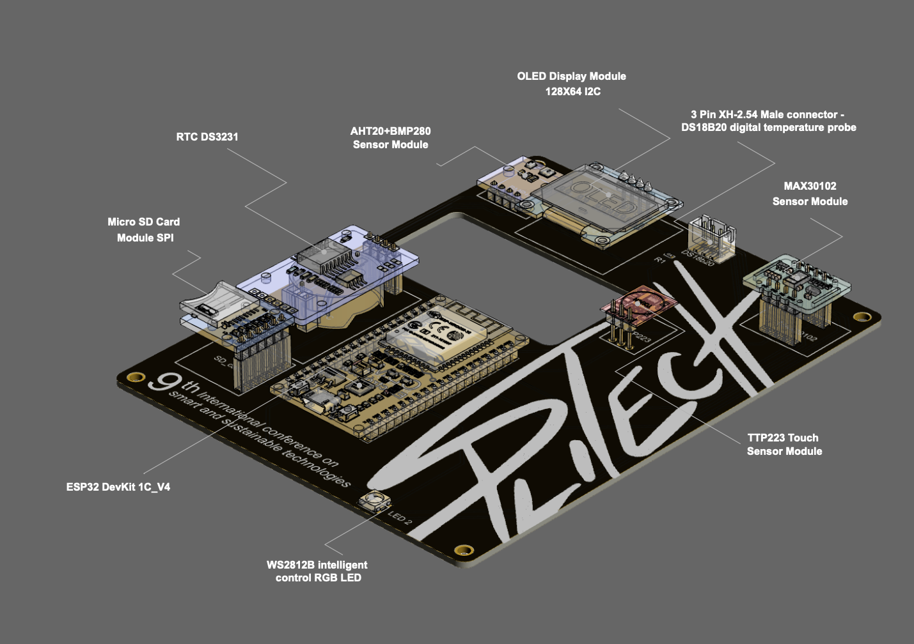

# IoT Essentials: Crafting simple but powerful data pipelines

This documentation provides an overview and a walkthrough for the
[IoT day workshop](https://iotday.splitech.org) organized at the
[SplitTech 2024](https://splitech.org/Home) conference held on June 25th, 2024. The
workshop was conceptualised as a tutorial session, dedicated to a specific topic titled "Crafting
simple but powerful data pipelines".

This session combined academic concepts with practical excercises in a hands-on approach to utilise
the theoretical knowledge acquired for creating practical applications. Attendees are encouraged to
implement their own prototypes based on provided hands-on experience, while future development
possibilities could be explored.

More about the project could be found in the paper:

> [!WARNING]
> Link na rad

## Workshop structure

### Introduction (10 minutes)

- Workshop presentation and basic concepts overview
- Review of materials and tools required for the workshop

### Local server introduction (15-20 minutes)

- Overview of benefits of local server over cloud
- Infrastructure of the server
- Usage of the server, from ESP32 perspective

### MCU (ESP32) and Sensors setup (40-50 minutes)

- Overview of the ESP32 development kit and sensor modules (BMP and AHT)
- Demonstration of connecting sensors with ESP32
- Sensor management through the ESP32 platform
- Introduction to the Arduino IDE and ESP32 platform
- Firmware programming for data collection from sensors
- Testing firmware on ESP32

### InfluxDB Configuration (10-15 minutes)

- What is InfluxDB and its role in IoT applications
- Installation of InfluxDB on the Linux system
- Database and measurement configuration
- Using InfluxQL for data manipulation
- Demonstration of storing data from ESP32 into InfluxDB

### Data Visualization in Grafana (30-40 minutes)

- What is Grafana and its role in data visualization
- Installation of Grafana on the Linux system
- Configuration of Grafana to connect with InfluxDB database
- Creating visualizations in Grafana for real-time data monitoring
- Adding sensor data from InfluxDB to Grafana
- Customizing and configuring graphs and table views

### Conclusion and Discussion (10-20 minutes)

- Independent practical work
- Different approaches to DB deployment and visualisation tools
- Summary of key points learned and reflections on the workshop
- Discussion on applications of the learned skills in real projects

## Workshop lecturers' contact information

- [Milovan Medojević](https://www.linkedin.com/in/milovan-medojevic/)
- [Dušan Simić](https://www.linkedin.com/in/dusansimic/)

## The PCB

The PCB design overview, developed for the workshop, is shown below. Feel free to refer to the
[paper]() to familiarise yourself with the concept, PCB schematic and the module-related datasheets.

## PCB assembly

The PCB Assembly is performed in an easy manner by placing the through-hole modules in adequate
headers provided on the board. Please refer to the image above to check and follow the provided
pinout. The image below illustrates the step-by-step positioning of the modules onto the PCB:

> [!WARNING]
> TODO: pcb assembly instructions

## Programming environment

In order to assure compatibility, we recommend using the following tools for your programming
environment. If you want to change those tools, there might be some compatibility issues which would
need to be worked out.

### Arduino IDE

For the workshop, Arduino IDE 2.0 was used, specifically version 2.3.2, which can be downloaded from
the [GitHub releases page](https://github.com/arduino/arduino-ide/releases/tag/2.3.2). That is the
official source for Arduino IDE installations at the time of writing. You can also download the
latest version of Arduino IDE from the [official website](https://www.arduino.cc/en/software).

#### Windows systems

On most newer versions of Windows, ESP32 connection should work fine without any manual intervention
but if you experience any issues (i.e. locating COM port for ESP32 module), you should install a
driver for it.

You can follow the instructions provided
[here](https://learn.sparkfun.com/tutorials/how-to-install-ftdi-drivers/windows---quick-and-easy)
to fix it. The FTDI driver used at the workshop is `cbm21228`.

Make sure you restart your system in order to let Windows load the drivers properly.

#### macOS systems

This code has been tested on macOS 14 Sonoma and one manual step was needed to make sure Arduino IDE
works as expected. You need to install the XCode package from the AppStore in order to be able to
compile the code for ESP32 devices.

#### Linux systems

On a majority of Linux distributions you will need to manually allow your user to access and write
to device file in order to estably communication with ESP32. To do this you need to add your user
account to the dialout group.

You can follow the
[official documentatino](https://support.arduino.cc/hc/en-us/articles/360016495679-Fix-port-access-on-Linux)
for this issue.

### ESP32 Board in Arduino IDE

Since ESP32 development module was used for the workshop, you'll need to install support for ESP32
boards in Arduino IDE. You can follow the
[official documentation](https://docs.espressif.com/projects/arduino-esp32/en/latest/installing.html)
for adding Espressif board repositories. The version of the board software used is 2.0.14, which is
important to note for this scenario since the code used is not fully compatible with 3.0 version.

### InfluxDB library

Also needed for the workshop is the InfluxDB library for ESP8266 compatible devices (which includes
ESP32) which is available in the
[official Arduino repositories](https://www.arduino.cc/reference/en/libraries/esp8266-influxdb/).
The version used during the workshop is 3.12.x but 3.13.2 should fix the issue with ESP32 3.0 board
software.

## Walkthrough

A [walkthrough](./WALKTHROUGH.md) for the workshop was written which you can follow on your own at
your own pace. If you have any questions regarding the implementation of the whole workshop or any
future development ideas, please don't hesitate to reach out.

## License

This code and the walkthrough are licensed under the [BSD 2-clause license](./LICENSE).
