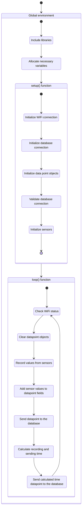

# Welcome to SpliTech IoT Day 2024 -- IoT Essentials: Crafting simple but powerful data pipelines

During this workshop, our goal is to show you how easy and simple it is to create a device that
could gather various information from it's environment, and later that data can be aggregated from
various devices into one single database from where it can be analyzed, interpreted and visualised.

## The firmware

For easiest workflow, we've prepared for you code snippets which can be easily copied and further
modified in order to create firmware for the ESP32 development boards. Each segment of the code
could be represented by one state in the state diagram below.



### Include libraries

In order for our firmware code to be able to acomplish all the action we need (connection to WiFi,
connecting to database, recording sensor values and sending them to the database), we will need to
first include them into our program source code.

In the snippet below, we're including all the required libraries.

```c++
#include <Wire.h>
#include "Adafruit_BMP280.h"
#include "AHT10.h"
#include <WiFi.h>
#include <WiFiMulti.h>
#include <InfluxDbClient.h>
#include "config.h"
```

### Allocate necessary variables

Besides including libraries, for our firmware to function, we will need to allocate some special
variables that are going to be used throughout the firmware code.

First two are used for reading environment parameters from sensors. That is done through an object
that can comunicate with a sensor over the I<sup>2</sup>C protocol.

Second group of variables is actually, just one variable, which is again an object used for handling
a part of hardware. In this case it is a WiFiMulti object which is used for connecting and managing
connections to a WiFi access point.

Third group of variables are two datapoints which are used for storing recorded information and
later sending it into the database and third is the client library for the InfluxDB database.

Lastly, we have several simple integer variables which are used for measuring time needed to
complete the whole process of recording and sending of the data to the database.

```c++
Adafruit_BMP280 bmp;
AHT10 AHT20(AHT10_ADDRESS_0X38, AHT20_SENSOR);

WiFiMulti wifiMulti;

InfluxDBClient client(INFLUXDB_URL, INFLUXDB_NAME);
Point pointDevice("sensors");
Point timesPointDevice("times");

unsigned long loop_start;
unsigned long start_reading;
unsigned long start_sending;
unsigned long iteration_complete;
unsigned long loop_end;
unsigned long iteration_count;
```

### Setup and initialization function

As with any program, we need to set up and configure all resources that we ware going to use, which
in programs written in Arduino IDE is done in the `setup()` function.

First thing that is done is initializing the serial communication (over the USB cable) at some
specific baud rate. With that we're setting the frequency of communication and calibrating ESP32 to
"speak" at the same frequency as Arduino IDE so they can comunicate.

Second thing is connecting to the WiFi access point for which we're using the parameters defined in
the `config.h` file.

Third thing is setting the database connection parameters and adding tags needed for the data point.
After that we're also validating the database connection we've configured previously.

As a final step in the setup, we're initializing the sensor communication over I<sup>2</sup>C
protocol. This is done by running methods on the objects created for gathering data from sensors.

```c++
void setup() {
  Serial.begin(115200);

  while (!Serial);

  WiFi.begin();
  WiFi.mode(WIFI_STA);
  wifiMulti.addAP(WIFI1_SSID, WIFI1_PASS);

  client.setConnectionParamsV1(INFLUXDB_URL, INFLUXDB_NAME, INFLUXDB_USER, INFLUXDB_PASS);

  pointDevice.addTag("device", INFLUXDB_TAG_DEVICE);
  pointDevice.addTag("senslist", INFLUXDB_TAG_SENSOR_LIST);
  timesPointDevice.addTag("ssid", WIFI1_SSID);

  if (client.validateConnection()) {
    Serial.print("Connected to InfluxDB: ");
    Serial.println(client.getServerUrl());
  } else {
    Serial.print("InfluxDB connection failed: ");
    Serial.println(client.getLastErrorMessage());
  }

  if (!bmp.begin()) {
    Serial.println("BMP280 initialization failed...");
    while(1);
  }

  if (!AHT20.begin()) {
    Serial.println("AHT20 initialization failed...");
    while(1);
  }

  bmp.setSampling(Adafruit_BMP280::MODE_NORMAL,
                  Adafruit_BMP280::SAMPLING_X2,
                  Adafruit_BMP280::SAMPLING_X16,
                  Adafruit_BMP280::FILTER_X16,
                  Adafruit_BMP280::STANDBY_MS_500);
  iteration_count = 0;
}
```

### Data gathering and sending loop function


```c++
```
