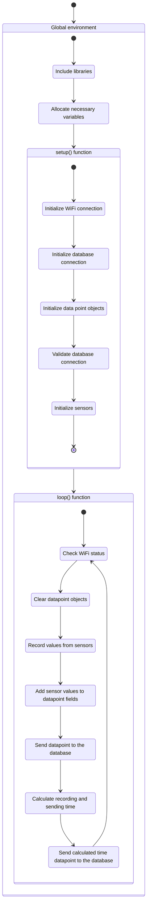
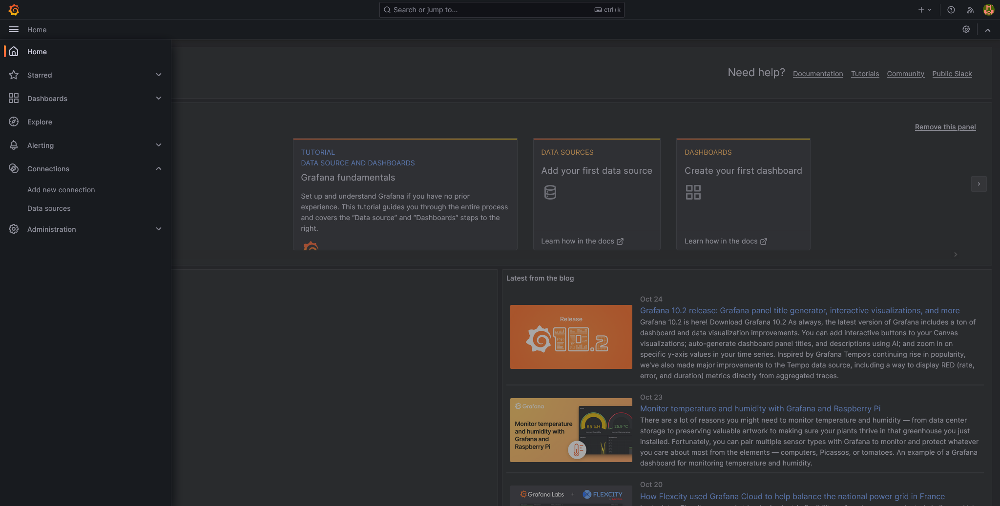
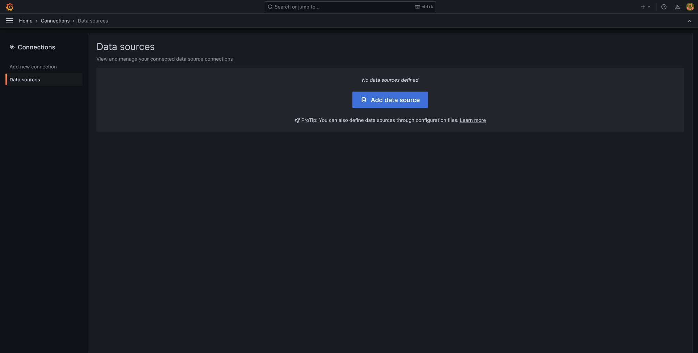
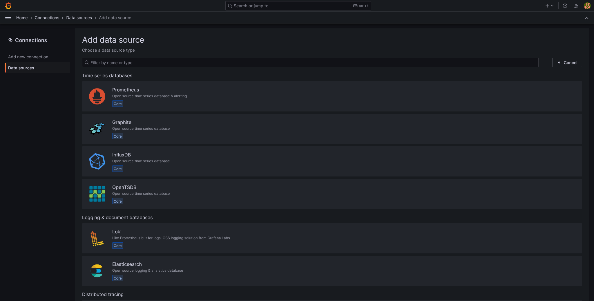
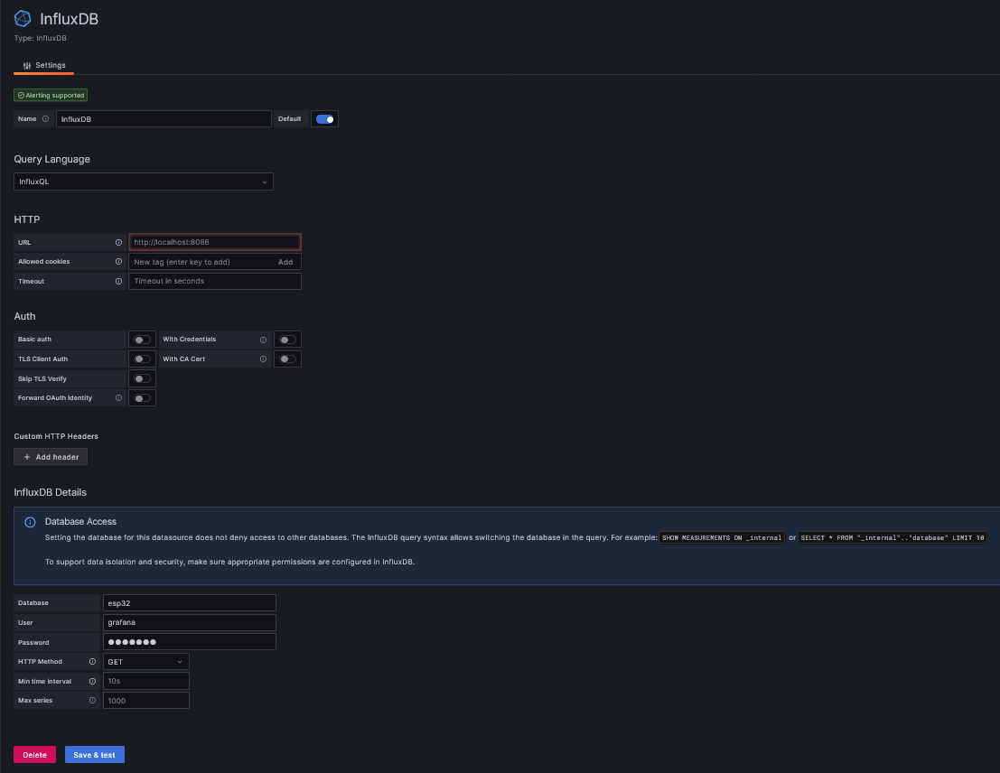
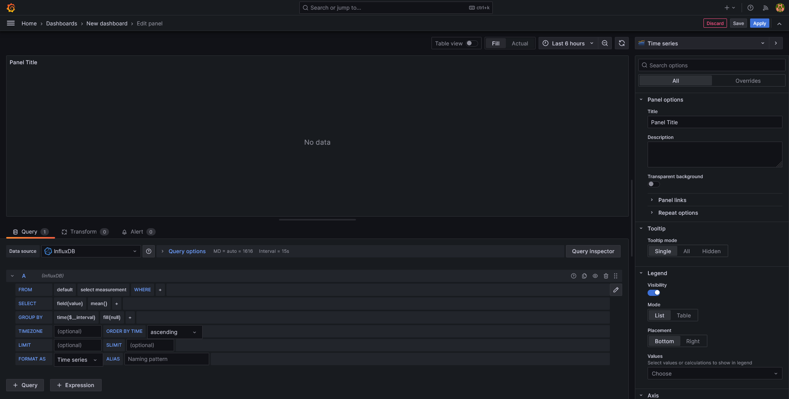
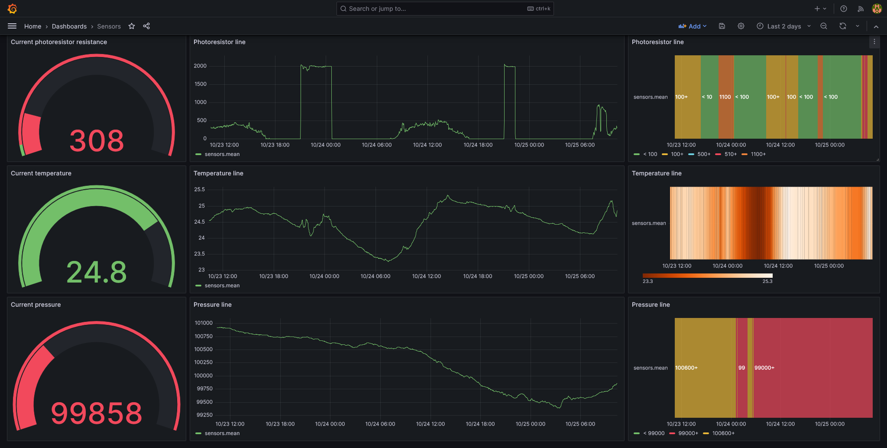

# Welcome to SpliTech IoT Day 2024 -- IoT Essentials: Crafting simple but powerful data pipelines

During this workshop, our goal is to show you how easy and simple it is to create a device that
could gather various information from it's environment, and later that data can be aggregated from
various devices into one single database from where it can be analyzed, interpreted and visualised.

## The firmware

As a first step in working with any microcontroller, we need to make sure our that it works
correctly and we can read data from it without connecting to any external resources, such as a
database.

This can easily be done by printing out on the serial console some string. A serial console is a
simple method to show information that is being sent by the microcontroller over the USB cable.

To do this, we can just use the code that already exists in the `Firmware.ino` file. It will begin
the serial communication and print every second a greeting message.

Once we've asserted that it works correctly, we can move on to the next part which is planning out
and implementing our firmware which will send informationg gathered from sensors to the database.

For easiest workflow, we've prepared for you code snippets which can be easily copied and further
modified in order to create firmware for the ESP32 development boards. Each segment of the code
could be represented by one state in the state diagram below.



### Include libraries

In order for our firmware code to be able to acomplish all the action we need (connection to WiFi,
connecting to database, recording sensor values and sending them to the database), we will need to
first include them into our program source code.

In the snippet below, we're including all the required libraries.

```c++
#include <Wire.h>
#include "Adafruit_BMP280.h"
#include "AHT10.h"
#include <WiFi.h>
#include <WiFiMulti.h>
#include <InfluxDbClient.h>
#include "config.h"
```

### Allocate necessary variables

Besides including libraries, for our firmware to function, we will need to allocate some special
variables that are going to be used throughout the firmware code.

First two are used for reading environment parameters from sensors. That is done through an object
that can comunicate with a sensor over the I<sup>2</sup>C protocol.

Second group of variables is actually, just one variable, which is again an object used for handling
a part of hardware. In this case it is a WiFiMulti object which is used for connecting and managing
connections to a WiFi access point.

Third group of variables are two datapoints which are used for storing recorded information and
later sending it into the database and third is the client library for the InfluxDB database.

Lastly, we have several simple integer variables which are used for measuring time needed to
complete the whole process of recording and sending of the data to the database.

```c++
Adafruit_BMP280 bmp;
AHT10 AHT20(AHT10_ADDRESS_0X38, AHT20_SENSOR);

WiFiMulti wifiMulti;

InfluxDBClient client(INFLUXDB_URL, INFLUXDB_NAME);
Point pointDevice("sensors");
Point timesPointDevice("times");

unsigned long loop_start;
unsigned long start_reading;
unsigned long start_sending;
unsigned long iteration_complete;
unsigned long loop_end;
unsigned long iteration_count;
```

### Setup and initialization function

As with any program, we need to set up and configure all resources that we ware going to use, which
in programs written in Arduino IDE is done in the `setup()` function.

First thing that is done is initializing the serial communication (over the USB cable) at some
specific baud rate. With that we're setting the frequency of communication and calibrating ESP32 to
"speak" at the same frequency as Arduino IDE so they can comunicate.

Second thing is connecting to the WiFi access point for which we're using the parameters defined in
the `config.h` file.

Third thing is setting the database connection parameters and adding tags needed for the data point.
After that we're also validating the database connection we've configured previously.

As a final step in the setup, we're initializing the sensor communication over I<sup>2</sup>C
protocol. This is done by running methods on the objects created for gathering data from sensors.

```c++
void setup() {
  Serial.begin(115200);

  while (!Serial);

  WiFi.begin();
  WiFi.mode(WIFI_STA);
  wifiMulti.addAP(WIFI1_SSID, WIFI1_PASS);

  client.setConnectionParamsV1(INFLUXDB_URL, INFLUXDB_NAME, INFLUXDB_USER, INFLUXDB_PASS);

  pointDevice.addTag("device", INFLUXDB_TAG_DEVICE);
  pointDevice.addTag("senslist", INFLUXDB_TAG_SENSOR_LIST);
  timesPointDevice.addTag("ssid", WIFI1_SSID);

  if (client.validateConnection()) {
    Serial.print("Connected to InfluxDB: ");
    Serial.println(client.getServerUrl());
  } else {
    Serial.print("InfluxDB connection failed: ");
    Serial.println(client.getLastErrorMessage());
  }

  if (!bmp.begin()) {
    Serial.println("BMP280 initialization failed...");
    while(1);
  }

  if (!AHT20.begin()) {
    Serial.println("AHT20 initialization failed...");
    while(1);
  }

  bmp.setSampling(Adafruit_BMP280::MODE_NORMAL,
                  Adafruit_BMP280::SAMPLING_X2,
                  Adafruit_BMP280::SAMPLING_X16,
                  Adafruit_BMP280::FILTER_X16,
                  Adafruit_BMP280::STANDBY_MS_500);
  iteration_count = 0;
}
```

### Data gathering and sending loop function

#### Simple begining

Once we've set everything up in our firmware code, we can focus on gathering the data from sensors
in the loop function. For a simple start, we'll just read the temperature from the AHT20 sensor and
print it out on the serial console. The, the microcontroller will sleep for 1 second and as the
function finishes executing, it will start again and repeat the whole process.

```c++
void loop() {
  double aht20temp = (double) AHT20.readTemperature();
  Serial.print("AHT20 Temperature: ");
  Serial.println(aht20temp);
  delay(1000);
}
```

#### Now send it to the database

As we've made sure that reading the sensor values works, we can implement the code that will do the
whole logic of the gathering data, preparing thte data point and insert it into the database.

The first step is to record the current clock time on ESP32 at the start of the loop function. This
will later help us calculate how much time it takes for each segment of code to execute. At the end,
we will record that information too into the database.

Second, we need to check whether we're still connected to the WiFi access point. Devices can for
various reasons lose connection at some point, so we need to make sure we're still connected to the
network in order to send data to the database.

Now that we can safetly proceed with gathering data, we'll need to clear all fields from the
datapoint in order to later set new field values and record them in the database.

Before actually reading the data, we need to record current clock time so we can later precisely
measure time it takes to read the data. Depending on the sensor, it can be instant but it can also
take some time.

Right after the data is read, we will add it as a field in the data point.

__This is where you come in!__

We want to also read other values available from the sensors, save them in variables and add them as
fields in the data point object. Instructions for reading additional data and adding it as fields
can be found in the comment in code below.

Once we've gathered all the information from sensors and added them as fields in our data point,
we are recording the clock time again so we later know how much time it took to read the information
and after that, to send it.

As a final step in the process of reading and sending sensor values, we're using the InfluxDB client
library to send the data point we've just populated. When that is done, we can record the clock time
again to precisely calculate the time required for the whole process and we're also incrementing the
iteration counter to distinguish between various iterations.

We're then populating the times data point with the calculated times and send that data point to the
database too.

As a final step, we need to wait 1 second to start the iteration again, but there is a small catch.
If we wait for 1 second, and the whole process of reading and sending data takes for example 700
milliseconds, in total the data points would be 1.7 seconds between each other, which is much closer
to 2 seconds than one second and that would add up in the long run. For that reason we're
subtracting how much time i took to read and send data from that one second and we wait for that
amount of time.


```c++
void loop() {
  loop_start = millis();

  if (wifiMulti.run() != WL_CONNECTED) {
    Serial.println("Not connected to WiFi!");
    delay(1000);
    return;
  }

  pointDevice.clearFields();
  timesPointDevice.clearFields();

  start_reading = millis();

  double aht20temp = (double) AHT20.readTemperature();
  pointDevice.addField("aht20temperature", aht20temp);
  // TODO: Implement reading and adding a field for sensor values, for each
  //       other value that is being recorded.
  //       Functions for reading those values are:
  //         AHT20.readHumidity()
  //         bmp.readTemperature()
  //         bmp.readPressure()
  //         bmp.readAltitude()
  //
  //       We recommend using and modifying the previously implemented (above
  //       this comment section).

  start_sending = millis();

  if (!client.writePoint(pointDevice)) {
    Serial.print("InfluxDB write failed: ");
    Serial.println(client.getLastErrorMessage());
  }

  iteration_complete = millis();
  iteration_count++;

  timesPointDevice.addField("rssi", WiFi.RSSI());
  timesPointDevice.addField("read", start_calculating - start_reading);
  timesPointDevice.addField("calc", start_sending - start_calculating);
  timesPointDevice.addField("send", iteration_complete - start_sending);

  if (!client.writePoint(timesPointDevice)) {
    Serial.print("InfluxDB write failed: ");
    Serial.println(client.getLastErrorMessage());
  }

  loop_end = millis();

  if (loop_end - loop_start < DELAY_BEFORE) {
    delay(DELAY_BEFORE - (loop_end - loop_start));
  }
}
```

### Configuring connection parameters

As our last step in implementing firmware, we need to configure the connection parameters for WiFi
access point and for the InfluxDB.

This is done in a separate file called `config.h`. This is a convention for configuring firmwares,
keep configurations in a separate file and the logic for the firmware in a main file.

The following code snipped can be placed in the configuration file.

First we configure the SSID and PASS parameters which are the access point name (`IoTWorkshop`) and
access point password (`SpliTech2024`).

Second part is configuration for the InfluxDB datbase. We need to configure the database url which
is `http://192.168.0.10:8086` and database name, username and password are all the same, `userXX`
where `XX` is the number you've been assigned during the workshop.

We're also defining tag content here but also delay between each data point. These values can be
left as is, but you can also play around with them.

```c++
#define WIFI1_SSID "access point name"
#define WIFI1_PASS "access point password"

#define INFLUXDB_URL "database address"
#define INFLUXDB_NAME "database name"
#define INFLUXDB_USER "database user"
#define INFLUXDB_PASS "database password"

#define INFLUXDB_TAG_DEVICE "esp32iottest"
#define INFLUXDB_TAG_SENSOR_LIST "aht20,bmp280"

#define DELAY_BEFORE 1000
```

## Setting up Grafana

Once we start sending data to the database, we want to query it and visualise it on some
visualisation too. It can be either a custom application or an already existing too for that
purpose. The industry standard tool for visualising data from various data sources, especially time
series databases is Grafana.

### Configuring the connection parameters

To start working with Grafana on this workshop, we first need to be connected to the same network it
is hosted on, which is `IoTWorkshop`. Just connect to the WiFi network on your workshop computers
with the same password used in the configuration parameters in firmware, `SpliTech2024`.

Once that is done, we can connect to the Grafana web interface by opening
[http://192.168.0.10:3000](http://192.168.0.10:3000). There you can log into your specific user by
typing in the username and password which are both `userXX` where `XX` is the number you've been
assigned during the workshop.

There you will be greeted with a home screen for Grafana and a menu where you can navigate through
its interface.



We will now need to add a data source for visualisation, which in our case is the InfluxDB where all
our sensor values are being recorded.

Navigate in the menu to the connections section and then to the data sources page. There you can
click on the "Add data source" button from where we can select our data source and configure it.



When prompted with the data sources list, click on InfluxDB. There you will see a form with database
connection parameters (similar to ones we've configured in the firmware).



The important parameters that need to be configured are the HTTP URL which in case of Grafana can be
set to `http://localhost:8086` because it is located on the same server as the database.

All of the authentication options should be unchecked.

Finally, we're configuring the database parameters where you need to put in the name of the database
you're connecting to, username for that database and the password. All of those options are the same
and are `userXX`, where `XX` is the number you've been assigned during the workshop.

The HTTP method needs to be set to `GET`.

Once done, click on the "Save & test" button which will save the parameters and validate the
connection.

In the image below, the connection parameters are not the same for your case, since you will have
a different database name and login parameters.



Now we're officially ready to visualise and analyze information stored in the database.

### Creating dashboards

To visualise the information from the database, we need to create dashboards. They are panels where
we can place various graphs for which data is queried from the database.

To do that, open the Grafana menu, go to the dashboards page and create a new dashboard. By clicking
on the "Add visualization" button, we can add a new visualisation. You will be prompted with a
window for selecting the data source for that visualisation. Here you will pick the data source
you've created (the InfluxDB data source).

Once that is done, you will see a page where in the top part an empty panel is displayed (our
visualisation will be displayed there) and in the bottom part a query builder for the visualisation.
There you will select the measurement you want to query (our sensor data is located in the `sensors`
measurement) and the filed (second row, besides the SELECT statement) which is the value want to
plot on the dashboard.

On the right side, at the top of the properties menu, you can select the visualisation type used for
this visualisation. The default one is "Time series" (a line graph) but it can be various outher
visualisation types.



For an inspiration, you can check out a dashboard we've created.


